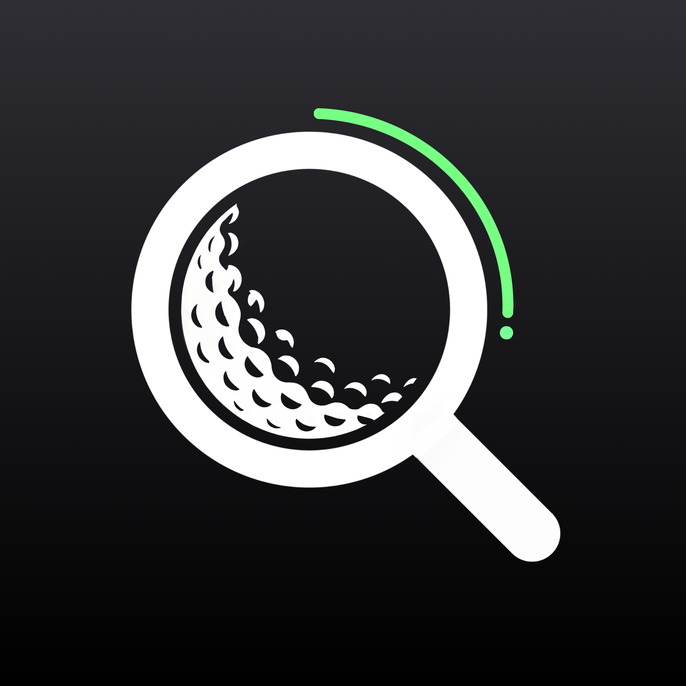

# ForeAI

## Description
Find your lost golf balls with this AI golf ball finder app.

## How It Works
1. Launch the app and grant it access to your camera.
2. Point your camera at the grass, rough, or other search area. ForeAI automatically highlights detected golf balls.
3. Once a ball is detected, tap lock to keep the marker anchored on the ball while you retrieve it.
4. Take a photo to analyze it with ForeAI’s highest-accuracy model and inspect the results in detail.
5. Customize settings and play around with the app to see which conditions work the best!

## Developer Notes
Model Architecture
* Fast - FP16 YOLO26n @ 640x640
* Standard - FP16 YOLO26s @ 640x640
* Enhanced - FP16 YOLO26s @ 1280x1280
* 848 training images with augmentation

Inference Pipeline
* Runs inference online by default via Cloudflared tunnel to my personal GPU
* Falls back to local inference through Sentis if connection is too weak
* Retries to connect every 15 seconds

Libraries & Packages
* Utilizes AR Foundation and XR Origin for camera feed and AR tracking
* CandyCoded's Haptic Feedback package (Copyright (c) 2021 Scott Doxey)
* YasirKula's Native Share package

Development Originality
* All written code is either original or available for public use
* AI tools & LLMs (Claude, Gemini, ChatGPT) were sporadically used throughout development (e.g. shader optimization, python server pipeline, pinch to zoom functionality, etc), but the code is heavily reviewed and understood to ensure optimal app performance
* As a whole, the app is human written by me, crafted manually rather than vibe coded

## Other Notes
The app works best under the following conditions:
* The ball is between 1 and 30 yards of distance,
* At least 20% of the ball is visible,
* The camera is steady and not moving very fast,
* The ball has good contrast with its surroundings.

While the app has been trained with a dataset of over 800 images of golf balls of different colors, taken in various settings and at various distances, it is by no means perfect. It does detect false positives (e.g. other round objects such as pebbles, leaves, or brightly colored flowers). Moreover, the AR tracking software, which is designed to keep the ball marker anchored on the ball while the phone moves, can perform inconsistently due to limitations with the AR Foundation plane detection library. Expect minor studders from the tracking software and slight freezes if the app is used for extended periods of time.

Developed by Jayden Newman (Epixest)
